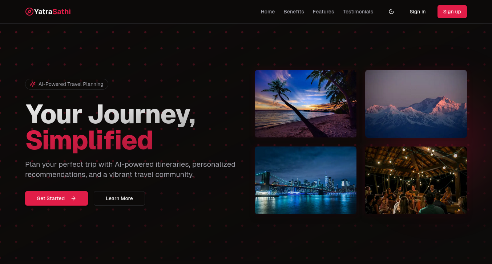

<div align="center">
  
  <p>Your Journey, Simplified</p>
</div>

This project is built with the [T3 Stack](https://create.t3.gg/), providing a modern travel companion platform.

## 📸 Screenshots

<div align="center">
  
  <p><em>Home Page</em></p>

  
  <p><em>User Dashboard</em></p>

  <!-- Add more screenshots as needed -->
</div>

## ✨ Features

- 🔐 Secure authentication with Clerk
- 🎯 Modern and responsive design
- 🚀 Fast and reliable performance
- 📱 Mobile-friendly interface
- 🛠️ Built with modern technologies

## 🚀 Getting Started

To run the application:

1. Clone the repository:

```sh
git clone https://github.com/Sthabiraj/yatrasathi
```

2. Navigate to the project directory:

```sh
cd yatrasathi
```

3. Copy the example environment file and update it:

```sh
cp .env.example .env.development
```

4. Set up Clerk Authentication:

   - Create an account at [Clerk.dev](https://clerk.dev)
   - Create a new application
   - Copy your Publishable Key and Secret Key to `.env.development`

5. Start the database:

```sh
docker compose up -d
```

6. Install dependencies:

```sh
bun install
```

7. Push the database schema:

```sh
bun db:push
```

8. Start the development server:

```sh
bun dev
```

## 🛠️ Tech Stack

- [Next.js](https://nextjs.org) - React framework
- [Clerk](https://clerk.dev) - Authentication and user management
- [Drizzle](https://orm.drizzle.team) - TypeScript ORM
- [Tailwind CSS](https://tailwindcss.com) - Utility-first CSS framework
- [tRPC](https://trpc.io) - End-to-end typesafe APIs

## 🚀 Deployment

The application can be deployed on various platforms:

- [Vercel](https://create.t3.gg/en/deployment/vercel)
- [Netlify](https://create.t3.gg/en/deployment/netlify)
- [Docker](https://create.t3.gg/en/deployment/docker)

## 📝 License

This project is licensed under the MIT License - see the [LICENSE](LICENSE) file for details.

## 🤝 Contributing

Contributions are welcome! Please feel free to submit a Pull Request.

---

<div align="center">
  <p>For more information, visit the <a href="https://create.t3.gg/">T3 Stack documentation</a></p>
  <p>Made with ❤️ by birajdotdev</p>
</div>
